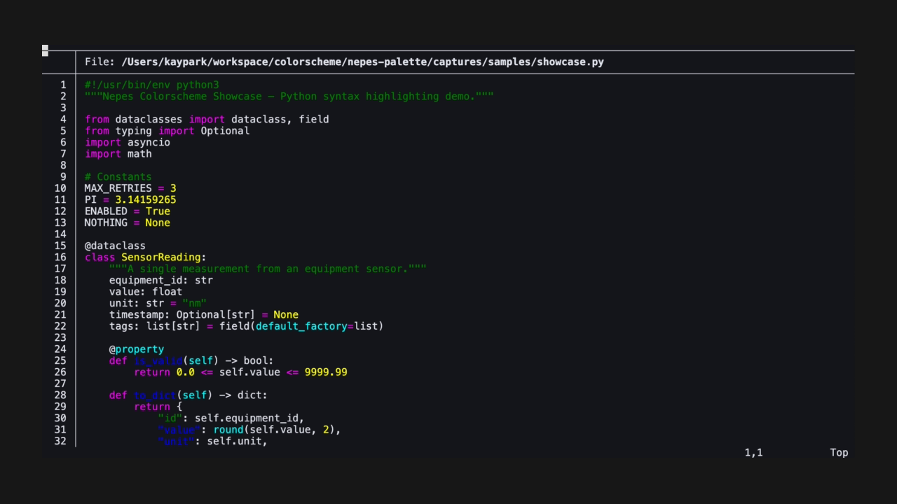

#+title: wezterm-nepes
#+description: Nepes color theme for WezTerm

GPU-accelerated terminal color scheme and status bar.

Part of the [[https://github.com/kayspark][Nepes Colorscheme]] suite.

* Screenshots

| Dark | Light |
|------+-------|
|  | [[file:docs/light.png]] |

* Installation

1. Clone this repo
2. Symlink to =~/.config/wezterm/colors/=
3. Set in =wezterm.lua=:
#+begin_src lua
config.color_scheme = 'nepes-dark'
#+end_src

* Credits

Generated by [[https://github.com/kayspark/nepes-palette][nepes-palette]].
